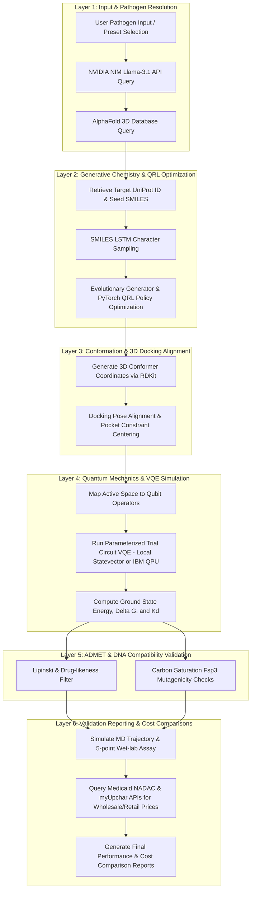

# QuantumShield Complete Workflow & Architecture A-Z

This document outlines the detailed theoretical foundation, stage-by-stage pipeline, modular architecture, local quantum simulation, IBM Hardware integration, ML generative models, and the complete technology stack behind the QuantumShield Drug Discovery project.

---

## 1. Project Overview & Theory
The goal of QuantumShield is to accelerate early-stage drug discovery (reducing traditional timelines from years to hours) by employing a hybrid Quantum Mechanics / Molecular Mechanics (QM/MM) pipeline alongside Reinforcement Learning (QRL).

### Key Physics and Chemical Parameters
* **Thermodynamic Binding Energy ($\Delta G$):** When a drug candidate binds to a target protein pocket (like TB's *InhA* or COVID-19's *Mpro*), it releases energy. Stronger (more negative) binding energy indicates a tighter, more stable physical blockade.
* **Dissociation Constant ($K_d$):** The drug concentration required to bind and inhibit exactly 50% of the target protein receptors. This is derived thermodynamic-classically from the binding energy ($\Delta G$):
  $$\Delta G = R T \ln(K_d) \implies K_d \approx 10^{\frac{\Delta G}{1.36}}\text{ Molar (at room temp)}$$
* **HOMO-LUMO Gap:** Evaluated using custom coordinates and structural group filters. Large gaps suggest high chemical stability and shelf life, whereas narrow gaps ($<8\text{ eV}$) raise toxicity alerts (potential covalent latches).
* **Fsp3 Saturation Index:** Checks carbon saturation. If a molecule has a completely flat carbon scaffold ($Fsp^3 = 0.0$), it can slip between DNA base pairs, triggering an "Extreme Risk (Flat Aromatic Toxicophore)" alert.

---

## 2. The 6-Layer Pipeline: From Input to Final Document Generation

The entire pipeline flows sequentially across 6 distinct logical layers, converting user input/parameters into a final verified candidate and comparative documentation:



### Layer 1: Input & Pathogen Resolution Layer
* **Trigger:** The user inputs a custom pathogen name (or selects a pre-defined template like Tuberculosis or COVID-19) and sets the optimization flags.
* **Orchestration:** The system queries the NVIDIA NIM API (`meta/llama-3.1-8b-instruct` model) using the environment's `NVIDIA_API_KEY` to retrieve the key target protein receptor name, UniProt ID, and a recommended seed drug SMILES string.
* **Target Mapping:** Using the resolved UniProt ID, the backend queries the EBI AlphaFold API to retrieve predicted 3D structure files (PDB). If needed, it queries UniProt KB APIs to resolve secondary accessions or query matches. The PDB file is parsed to extract the 3D spatial coordinates of the 10 closest active-site residues.

### Layer 2: Generative Chemistry & QRL Optimization Layer
* **Trigger:** The resolved target specs and seed SMILES are passed to the generative engine.
* **Generative Sampling:** A character-level SMILES LSTM (based on AstraZeneca's REINVENT architecture, with a 3-layer LSTM structure) samples raw candidate SMILES strings token-by-token.
* **RL Optimization:** A Reinforcement Learning (QRL) Agent built in PyTorch dynamically computes policy gradient updates. The agent scores generated candidates on drug-likeness (QED), synthetic accessibility (SA), and VQE-based binding affinity, reinforcing actions that lead to stronger, synthesizable compounds.

### Layer 3: Conformation & 3D Docking Alignment Layer
* **Trigger:** Selected raw SMILES strings are compiled into geometric conformations.
* **Conformer Generation:** Using RDKit, the system builds 3D conformers of the generated molecules and applies the MMFF94 force field to relax bond lengths, bond angles, and torsion angles to their lowest-energy state.
* **Docking Alignment:** The relaxed 3D molecule is dynamically translated and rotated to align its center of mass directly with the spatial center of the resolved AlphaFold pocket residues, preparing the molecular coordinate space for electronic Hamiltonian calculation.

### Layer 4: Quantum Mechanics & VQE Simulation Layer
* **Trigger:** The aligned molecular coordinate representation is processed to compute exact chemical energies.
* **Qubit Operator Mapping:** The valence orbitals are mapped from fermionic operators to qubit operator matrices (using mappers like Jordan-Wigner or Parity with $Z_2$-Symmetry reduction).
* **VQE Execution:** A parameterized trial circuit (`TwoLocal` ansatz with RY and CZ gates) is optimized using classical algorithms (COBYLA/SPSA). This runs either locally on the CPU (using Qiskit's `StatevectorEstimator`) or remotely on a physical IBM QPU (using `qiskit_ibm_runtime` sessions).
* **Thermodynamic Calculation:** The final converged eigenvalue is used to calculate the exact thermodynamic binding energy ($\Delta G$) and the dissociation constant ($K_d$).

### Layer 5: ADMET & DNA Compatibility Validation Layer
* **Trigger:** The chemical coordinates and thermodynamic values are evaluated for pharmacological feasibility.
* **ADMET Scoring:** RDKit computes molecular weight, LogP, hydrogen bond donors/acceptors, Topological Polar Surface Area (TPSA), and flags Lipinski rule violations.
* **DNA Mutagenicity Check:** The coordinate engine calculates the $Fsp^3$ carbon saturation index. Flat aromatic structures ($Fsp^3=0$) are flagged with an "Extreme Risk" warning to signify DNA intercalation risks.

### Layer 6: Validation Reporting & Cost Comparisons Layer
* **Trigger:** Validation records are compiled for reporting.
* **Assay Simulation:** The backend simulates Molecular Dynamics stability trajectories and runs a simulated 5-point log-dilution wet lab assay centering on $K_d$ to verify the target binding profile.
* **Pricing Resolution:** Queries the US CMS Medicaid API to get NADAC prices and the myUpchar API (`MYUPCHAR_API_KEY`) to get local retail prices in Indian Rupees (INR) for existing FDA reference drugs.
* **Output Generation:** Compares preclinical R&D timelines, synthetic steps, and costs (e.g. compressing $800M-$2.6B / 5-7 years down to $5M-$10M / 12-24 hours via QRL) to build interactive comparison charts, printable validation metrics, and final PDF-style documentation.

---

## 3. Modular Architecture & Directory Structure
The workspace is split into distinct functional modules:

```
c:\Quantum\quantumshield
├── app.py                     # Flask REST API & Core Routing Orchestrator
├── generator.py               # Generative Chemistry, Scoring, and Coordinate Engine
├── simulation.py              # Quantum Simulations, MD Trajectories & Wet-Lab Assays
├── qrl_optimizer.py           # Quantum Reinforcement Learning Agent & Training Loop
├── smiles_lstm/               # AstraZeneca REINVENT-based generative model modules
│   ├── model/
│   │   ├── smiles_lstm.py     # RNN class definitions (GRU/LSTM cells)
│   │   ├── smiles_dataset.py  # Dataset loader class for chemical strings
│   │   └── smiles_vocabulary.py # SMILES tokenizer mapping characters to integers
│   └── utils/                 # Helper utilities for data sanitization
├── pretrained.rnn.pth         # PyTorch weights for the pre-trained SMILES LSTM model
└── src/                       # React frontend source code
```

### Deep Dive into Key Modules
1. **[app.py](file:///c:/Quantum/quantumshield/app.py):** Operates the REST API endpoints. It coordinates coordinate generation, executes quantum runs, triggers DNA interaction analysis, and resolves live drug prices from US and Indian directories.
2. **[generator.py](file:///c:/Quantum/quantumshield/generator.py):** Orchestrates candidate optimization. It scores candidates for Lipinski rules, Synthesizability (SA Score), docking, and free energy. It also generates relaxed 3D coordinates using RDKit's MMFF94 force field.
3. **[simulation.py](file:///c:/Quantum/quantumshield/simulation.py):** Handles core quantum operations. Contains local VQE estimators, codesign logic for physical chip topology (e.g. heavy-hex layouts), molecular dynamics (MD) trajectories, and simulated wet-lab verification reports.
4. **[qrl_optimizer.py](file:///c:/Quantum/quantumshield/qrl_optimizer.py):** Implements a reinforcement learning agent policy network using PyTorch. It calculates policy gradients to drive the generative LSTM toward optimized binding energy configurations.

---

## 3. Generative ML Model (SMILES LSTM)
The generation of chemical lead structures relies on a recurrent language model:
* **The Model:** A character-level Recurrent Neural Network (RNN) using **LSTM** (Long Short-Term Memory) or GRU cells.
* **Architecture:** 
  * Input Embedding Layer: `embedding_size = 256`
  * Recurrent Network: 3 LSTM layers with `hidden_size = 512`
  * Output layer: Linear mapping back to vocabulary logits.
* **Tokenizer/Vocabulary:** Maps individual chemical characters (e.g., `C`, `N`, `=`, `(`, `)`, `[`, `]`) to integers. The token `^` designates the start of sequence, while `$` marks the completion of the string.
* **Pretrained Weights:** Stored in `pretrained.rnn.pth` (PyTorch binary).
* **Origin/GitHub Repository:** The implementation is based on **REINVENT**, AstraZeneca's pioneering generative framework for de novo molecular design. 
  * GitHub URL: [MolecularAI/Reinvent](https://github.com/MolecularAI/Reinvent)

---

## 4. AlphaFold 3D Structure Resolution
To obtain the spatial targets for custom pathogens without manual coordinate entry, the system integrates with the public AlphaFold Protein Structure Database:
1. **AlphaFold EBI API:** Queries `https://www.alphafold.ebi.ac.uk/api/prediction/{uniprot_id}` to download predicted 3D structure metadata.
2. **UniProt API Failovers:**
   * If a target ID is a secondary accession, the system resolves it using the UniProt KB API (`https://rest.uniprot.org/uniprotkb/{uniprot_id}.json`) to extract the `primaryAccession`.
   * If the ID is missing, the backend queries the UniProt KB Search API (`https://rest.uniprot.org/uniprotkb/search?query=...`) using target and pathogen keywords, prioritizing non-human organisms.
3. **PDB Parsing:** Once metadata is retrieved, it downloads the corresponding coordinate file (`pdbUrl`). The `parse_pdb_to_pocket` method extracts the spatial 3D coordinates (X, Y, Z, element, charge) of the 10 closest active-site residues to serve as VQE docking constraints.

---

## 5. Live Price & Drug Name Resolvers
To calculate exact market parameters and compare them against R&D costs, the backend coordinates several API streams:
* **Custom Pathogen AI Resolution:**
  * Endpoint: `https://integrate.api.nvidia.com/v1/chat/completions`
  * Model: `meta/llama-3.1-8b-instruct`
  * API Key: `NVIDIA_API_KEY` (configured in environment)
  * Function: Translates a user-entered pathogen name into its target receptor, UniProt ID, and the exact SMILES of its FDA-approved reference drug.
* **US CMS NADAC API (Medicaid):**
  * Endpoint: `https://data.medicaid.gov/api/1/datastore/query/{dataset_id}/0`
  * Function: Queries the National Average Drug Acquisition Cost (NADAC) dataset via `LIKE` queries matching the reference drug name to retrieve wholesale unit prices.
* **Indian Retail Price API (myUpchar):**
  * Endpoint: `https://beta.myupchar.com/api/medicine/search`
  * API Key: `MYUPCHAR_API_KEY` (configured in environment)
  * Function: Performs live searches of Indian databases to obtain local retail prices (MRP) in INR.

---

## 6. Local Quantum Simulation
When operating in offline/local mode, the system simulates the quantum processing unit on the classical CPU:
* **SDK:** Built on **Qiskit v1.x** primitives.
* **Operator Mapping:** Translates the molecular active-space Hamiltonian into qubit operators (using Jordan-Wigner, Parity with $Z_2$-Symmetry Reduction, or Bravyi-Kitaev mappers).
* **Wavefunction Preparation:** A trial state is prepared using a `TwoLocal` circuit (ansatz) comprising RY rotational gates and CZ entangling gates (depth: 2, CNOT: 1).
* **Local Estimator:** Local expectation values ($\langle H \rangle$) are computed via `StatevectorEstimator` from `qiskit.primitives`.
* **Classical Minimization:** Solves the variational principle iteratively using `COBYLA` or `SPSA` optimization algorithms to converge onto the ground state energy.

---

## 7. Connecting to Physical IBM Quantum Hardware
To run simulations on physical QPUs, users can provide their IBM Quantum API Token:
1. **Integration Library:** Uses the `qiskit_ibm_runtime` module.
2. **Connection Protocol:**
   * Initializes the service:
     ```python
     from qiskit_ibm_runtime import QiskitRuntimeService, Estimator as RuntimeEstimator, Session
     service = QiskitRuntimeService(channel="ibm_quantum", token=api_token)
     ```
   * Selects the backend: Queries the specified target (e.g. `ibm_brisbane`, `ibm_kyoto`) or defaults to the least busy operational device.
3. **Session Management:** Spawns a dedicated session (`Session(service=service, backend=backend)`) to bundle the iterative VQE circuit submissions, bypassing queue waiting times between optimization steps.
4. **Cloud Execution:** The `RuntimeEstimator` measures expectations on the physical hardware and returns error-mitigated counts back to the Flask API.

---

## 8. Frontend & Backend Technology Stack
* **Frontend:** React 19, Vite, Tailwind CSS (v4), Framer Motion (`motion`), Lucide Icons.
* **Backend:** Python 3.10+, Flask, Flask-CORS, PyTorch, RDKit, Qiskit, Requests.
* **External APIs:** Google Gemini AI (explanations), EBI AlphaFold (structures), UniProt KB (targets), US Medicaid (prices), myUpchar (local prices), NVIDIA NIM (LLM pathogen resolution).
