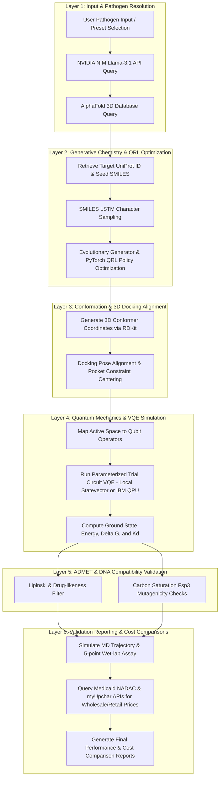
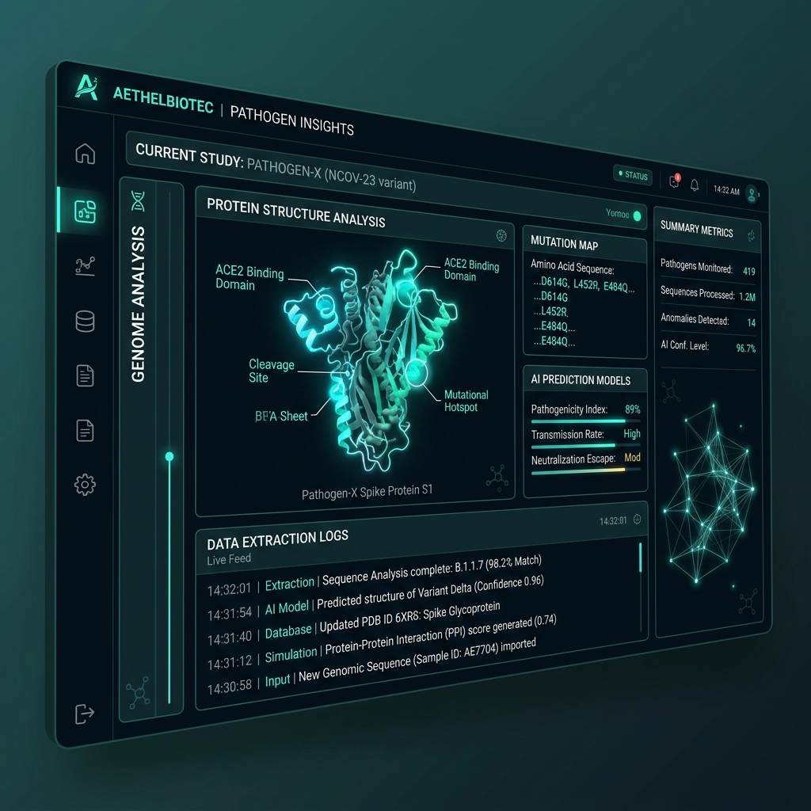
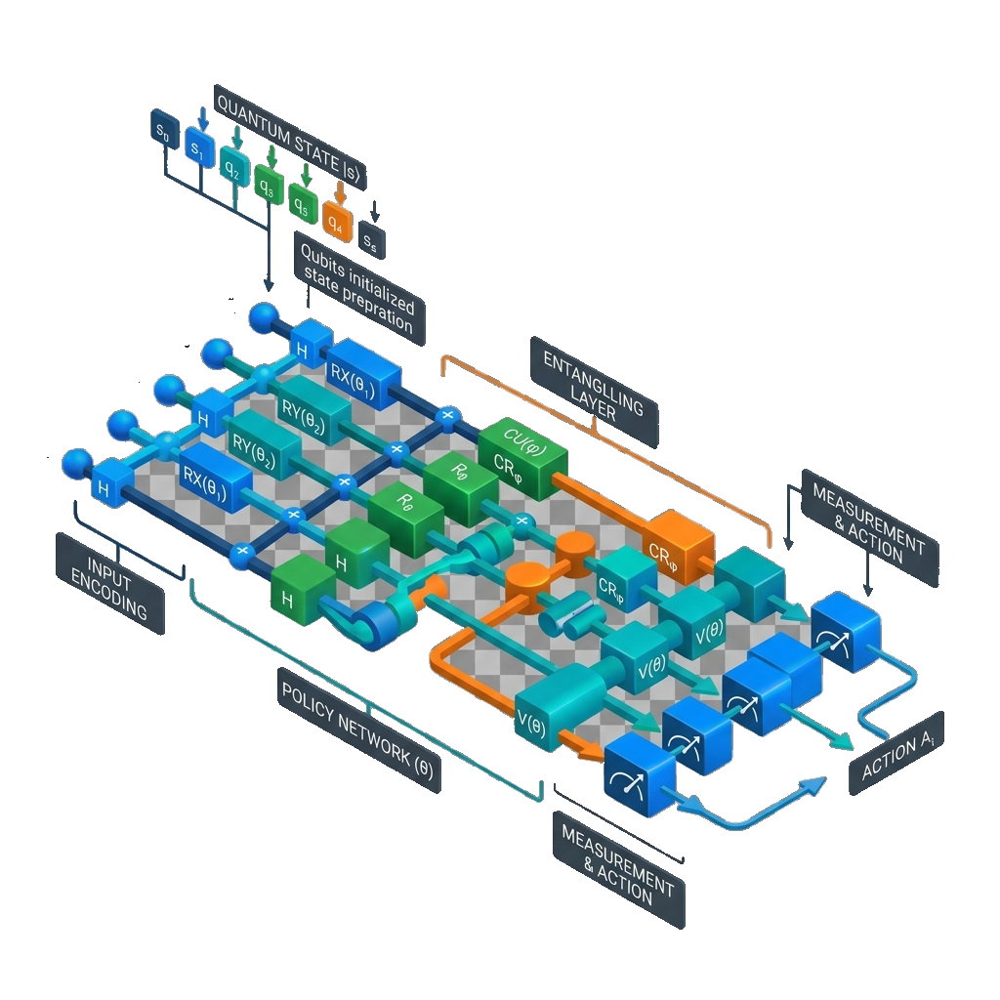
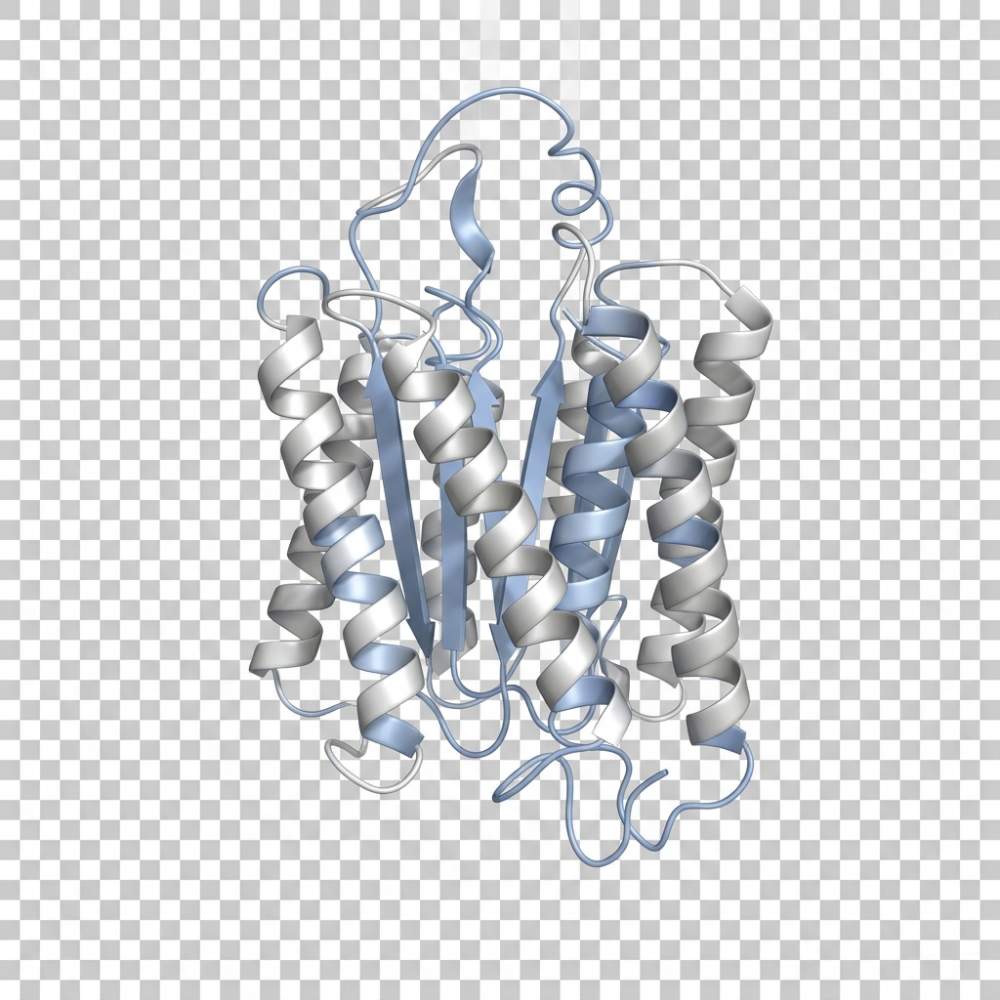
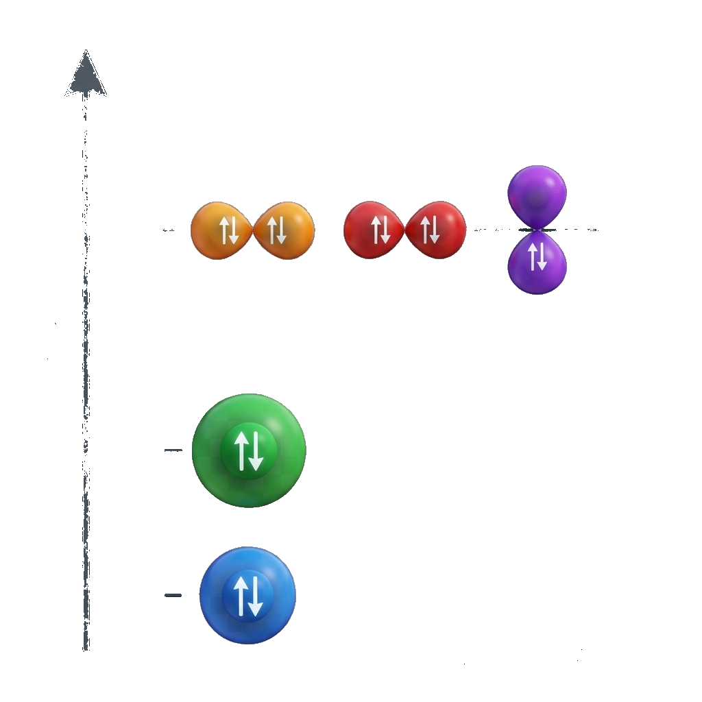
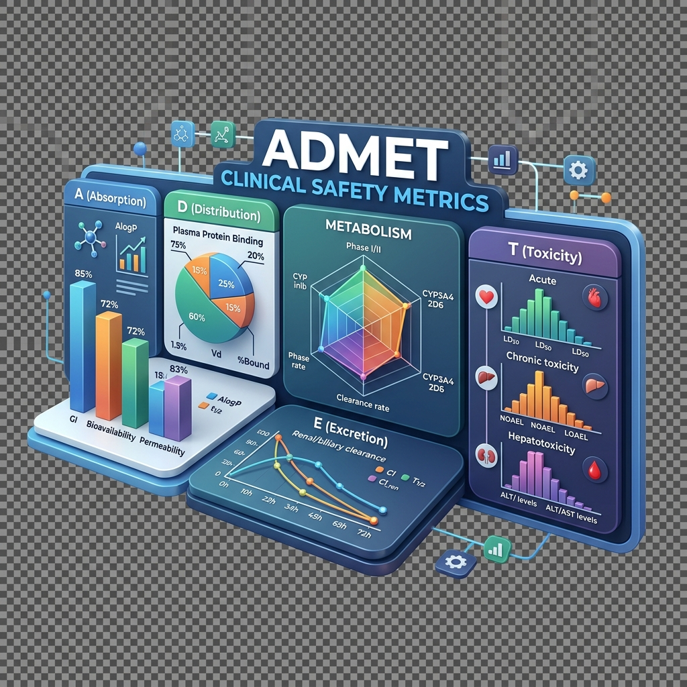
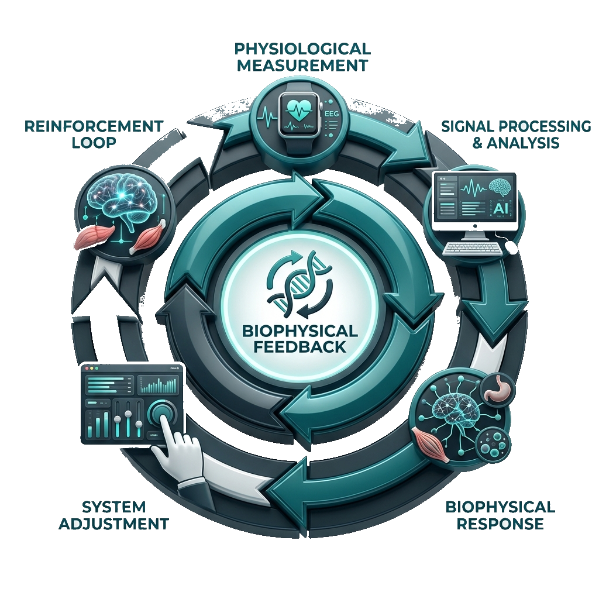

# QuantumShield: Quantum-Accelerated Drug Discovery Pipeline
## Slide Deck Presentation

---

# Slide 1: Introduction and Objective

## Overview
**QuantumShield** is a state-of-the-art hybrid Quantum Mechanics / Molecular Mechanics (QM/MM) and Reinforcement Learning (QRL) drug discovery platform. It is designed to disrupt the traditional pharmaceutical R&D paradigm by leveraging quantum algorithms to simulate molecular interactions with unprecedented accuracy.

## Objective
* **Accelerate Lead Optimization:** Compress early-stage drug discovery timelines from **5-7 years** down to **12-24 hours**.
* **Reduce Research Costs:** Lower pre-clinical screening costs from hundreds of millions of dollars to under **$10M**.
* **High-Precision Targeting:** Utilize Variational Quantum Eigensolvers (VQE) to calculate exact electronic ground states and binding affinities ($\Delta G$, $K_d$) for pathogen receptors.
* **Safer Lead Candidates:** Filter out toxic compounds early using carbon saturation ($Fsp^3$) and ADMET safety profiling.

---

# Slide 2: Motivation and Issues in Existing System

```
                  THE DRUG DISCOVERY BOTTLENECK
  
  [ Classical Screening ] ──> [ Guesswork / Empirical Scores ] ──> [ High Attrition Rate ]
            │                                                               │
            ▼                                                               ▼
     10,000+ Candidates                                            99.9% Fail in Wet-Lab
```

## The Crucial Problems
1. **Exponential Chemical Space:** There are over $10^{60}$ potential drug-like molecules. Classical computers cannot compute exact electronic structures of strongly correlated systems because quantum entanglement scales exponentially ($2^N$).
2. **Inaccurate Docking Scores:** Existing systems rely on classical mechanics force fields and scoring functions. These are quick guesses that ignore complex electron correlations, resulting in false positives.
3. **High Development Costs & Long Timelines:** Bringing a drug to market takes **10–12 years** and costs **$800M – $2.6B**. The main culprit is high late-stage attrition where in-silico leads fail in wet-lab tests.
4. **Mutagenicity and Toxicity Risks:** Traditional virtual screening platforms frequently approve flat aromatic compounds (e.g. benzene-like structures) because they bind tightly. However, their flat geometries allow them to slip into DNA base pairs (intercalation), causing severe toxicity.

---

# Slide 3: Proposed System

```
                 THE QUANTUMSHIELD ARCHITECTURE
  
  [ Pathogen Input ] ──> [ GenAI & QRL Policy ] ──> [ VQE Qubit Solver ] ──> [ ADMET & DNA Filter ]
```

## The QuantumShield Solution
* **Hybrid Quantum-Classical (QM/MM) Design:** Employs the co-processor model where 99.9% of housekeeping/preprocessing runs on the CPU, and the exponentially complex 0.1% active space is solved on a **Quantum Processing Unit (QPU)**.
* **Quantum Reinforcement Learning (QRL):** A generative SMILES LSTM optimized via policy gradient loops that reward candidates showing high binding affinity, synthetic feasibility, and low toxicity.
* **Exact VQE Energy Solvers:** Solves the Schrödinger equation using local statevector simulation or real physical **IBM Quantum** hardware to find exact molecular binding energies ($\Delta G$) and dissociation constants ($K_d$).
* **Fsp3 Saturation and ADMET Filters:** Performs coordinate-based carbon saturation checks to identify intercalation risks and scores candidates against Lipinski's Rule of 5 to guarantee clinical viability.

---

# Slide 4: System Architecture & Functional Workflow

## System Architecture Diagram
```mermaid
graph LR
    subgraph Client UI (React 19 + Framer Motion)
        A[Pathogen Search & Controls] --> B[Interactive 3D Viewport]
        B --> C[VQE Real-Time Convergence Charts]
    end

    subgraph Backend Server (Flask REST API)
        D[app.py Orchestrator] --> E[generator.py Molecular Engine]
        D --> F[qrl_optimizer.py QRL Policy]
        D --> G[simulation.py Quantum Simulator]
    end

    subgraph External & Cloud Resources
        E --> H[NVIDIA NIM & EBI AlphaFold API]
        G --> I[IBM Quantum QPU Cloud]
        D --> J[Medicaid NADAC & myUpchar APIs]
    end

    Client UI <--> Backend Server
```

---

## Functional Architecture Workflow Diagram


---

# Slide 5: Module 1 and 2 Details

## Module 1: Pathogen & Target Resolution Layer
* **Input:** Custom pathogen name (e.g. *Mycobacterium tuberculosis*) or dashboard preset.
* **Process:** 
  1. Queries the NVIDIA NIM API (`meta/llama-3.1-8b-instruct`) using the `NVIDIA_API_KEY` to resolve the pathogen to a target protein name, UniProt ID, and a recommended FDA-approved reference drug SMILES.
  2. Queries the EBI AlphaFold API to retrieve the predicted 3D structure (PDB file) of the target.
  3. Parses the PDB file to extract the 3D spatial coordinates of the 10 closest active-site residues.
* **Output to Next Stage:** Target protein coordinates, target UniProt ID, and reference seed SMILES.



---

## Module 2: Generative Chemistry & QRL Optimization Layer
* **Input:** Seed SMILES and target pocket coordinates from Module 1.
* **Process:**
  1. Generates novel candidate SMILES strings token-by-token using a 3-layer recurrent neural network (LSTM/GRU) character sampler.
  2. A Reinforcement Learning (QRL) agent in PyTorch computes policy gradient updates.
  3. The agent scores candidates on synthesizability, drug-likeness (QED), and VQE-based binding affinity, reinforcing steps that produce high-binding, stable molecules.
* **Output to Next Stage:** Highly optimized candidate SMILES string.



---

# Slide 6: Module 3 and 4 Details

## Module 3: Conformation & 3D Docking Alignment Layer
* **Input:** Candidate SMILES string from Module 2 and pocket coordinates from Module 1.
* **Process:**
  1. Utilizes **RDKit** to construct a 3D conformer of the candidate molecule.
  2. Applies the **MMFF94 force field** to relax bond lengths, bond angles, and torsion angles to their lowest-energy ground-state geometry.
  3. Performs an extrinsic alignment, translating and rotating the relaxed candidate molecule so its center of mass matches the center of the pocket residues.
* **Output to Next Stage:** Docked 3D coordinate representation of the target pocket and the drug candidate.



---

## Module 4: Quantum Mechanics & VQE Simulation Layer
* **Input:** Docked molecular coordinates from Module 3.
* **Process:**
  1. Maps the molecular active space from fermionic operators to qubit operators (using Jordan-Wigner or Parity with $Z_2$-Symmetry reduction).
  2. Prepares a trial wavefunction using a hardware-native `TwoLocal` ansatz (RY and CZ gates).
  3. Executes the Variational Quantum Eigensolver (VQE) algorithm (using classical minimizers like COBYLA/SPSA and Qiskit's local `StatevectorEstimator` or a physical IBM QPU via `qiskit_ibm_runtime`) to converge onto the ground state energy.
* **Output to Next Stage:** Quantum ground state energy, thermodynamic binding energy ($\Delta G$), and dissociation constant ($K_d$).



---

# Slide 7: Module 5 and 6 Details

## Module 5: ADMET & DNA Compatibility Validation Layer
* **Input:** Candidate molecular structure (SMILES/coordinates) and VQE thermodynamic parameters from Module 4.
* **Process:**
  1. Scores Lipinski's Rule of 5 parameters (molecular weight, LogP, H-bond donors/acceptors) and TPSA for pharmacokinetic suitability.
  2. Calculates carbon saturation ($Fsp^3$ index) by counting Carbon-neighbor coordinates.
  3. Flags flat aromatic molecules ($Fsp^3 = 0.0$) as extreme risks (mutagenic DNA intercalation dangers) and shrinks their HOMO-LUMO gap to alert researchers.
* **Output to Next Stage:** Validated safety profile, ADMET reports, and DNA intercalation flags.



---

## Module 6: Validation Reporting & Cost Comparisons Layer
* **Input:** Validated drug candidate data, safety parameters, and reference drug name.
* **Process:**
  1. Simulates molecular dynamics (MD) trajectories and a 5-point log-dilution wet lab assay centering on $K_d$ to verify the binding profile.
  2. Queries Medicaid NADAC (US wholesale) and myUpchar (Indian retail) APIs to fetch current market prices of reference drugs.
  3. Computes comparative preclinical timeline and financial savings metrics.
* **Output to Next Stage:** Interactive comparison charts, printable validation reports, and PDF-style documentation of final candidates.



---

# Slide 8: References

1. **REINVENT Generative Framework:** AstraZeneca's recurrent generative model for de novo molecular design. GitHub: [MolecularAI/Reinvent](https://github.com/MolecularAI/Reinvent)
2. **Qiskit Core SDK:** IBM's open-source SDK for working with quantum computers. GitHub: [Qiskit/qiskit](https://github.com/Qiskit/qiskit)
3. **RDKit Cheminformatics:** Open-source toolkit for chemistry informatics. Website: [rdkit.org](https://www.rdkit.org/)
4. **Lovering Carbon Saturation Study:** Lovering, F., Bikker, J., & Humblet, C. (2009). Escape from Flatland: Increasing Saturation as an Approach to Improving Clinical Success. *Journal of Medicinal Chemistry*, 52(21), 6752–6756.
5. **AlphaFold Protein Database:** EBI Predicted Protein Structure API. Website: [alphafold.ebi.ac.uk](https://www.alphafold.ebi.ac.uk/)
6. **UniProt Database:** Protein sequence and functional information repository. Website: [uniprot.org](https://www.uniprot.org/)
7. **Medicaid Drug Pricing:** National Average Drug Acquisition Cost (NADAC) Query API. Website: [data.medicaid.gov](https://data.medicaid.gov/)
8. **myUpchar Medicine Directory:** Live search endpoint for Indian pharmaceutical pricing. Website: [myupchar.com](https://www.myupchar.com/)
